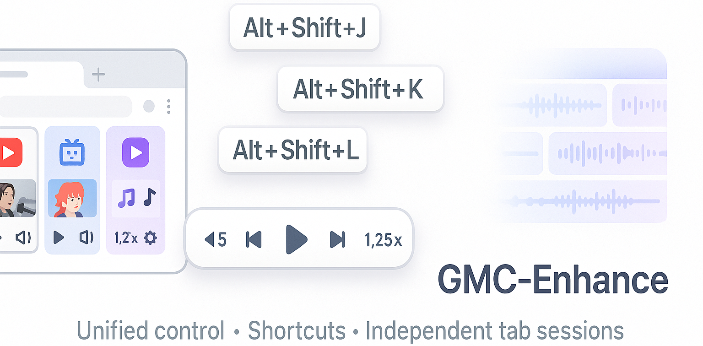
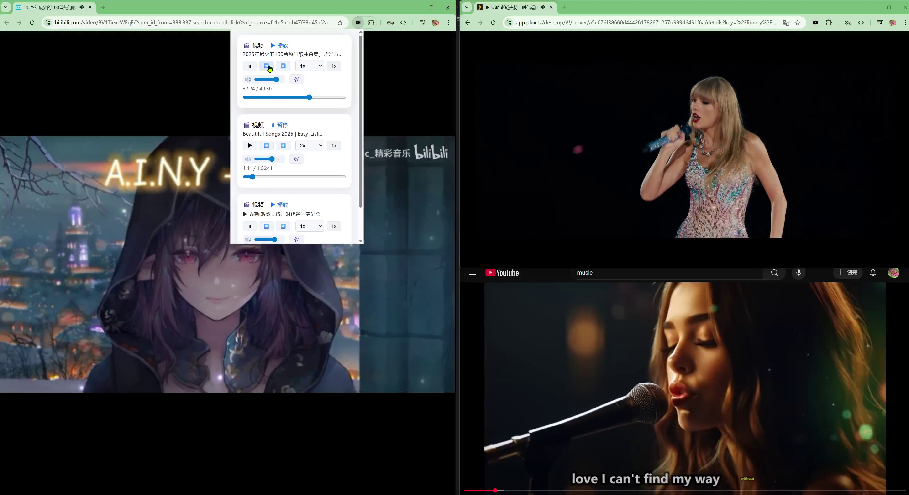

# GMC-Enhance

Unified Control · Powerful Shortcuts · Independent Tab Sessions

Global Media Control (GMC)-Enhance is a Chrome extension that supercharges Chrome's built‑in Global Media Control. It delivers true **unified control** across all your media, **global shortcuts** for instant actions, and **independent tab sessions** so each tab keeps its own playback, speed, and effect state without interference.

---

## Table of Contents

1. [Features](#features)
2. [User Guide](#user-guide)
   - [Basic Playback Control](#1-basic-playback-control)
   - [Audio Effects Control](#2-audio-effects-control)
   - [Shortcuts](#3-shortcuts)
3. [Contributing](#contributing)
4. [License](#license)

---

## Features

GMC-Enhance offers a range of features to improve your media playback experience:

- [x] **Unified Media Control**: Manage all media sessions from a single toolbar interface without switching tabs.
- [x] **Playback Control**: Play, pause, skip backward/forward, and adjust playback speed.
- [x] **Global Shortcuts**: Customizable keyboard shortcuts for instant control (seek, speed, volume, mute, select active video).
- [x] **Independent Tab Sessions**: Each tab maintains its own playback speed, selected target video, volume, and audio effect state—no accidental cross‑tab interference.
- [x] **Volume Control**: Adjust volume levels for individual videos, including mute/unmute options.
- [x] **Audio Effects**: Enhance audio quality by adjusting specific frequency bands (e.g., reduce vocals or boost bass).
- [x] **Floating Window**: Displays a floating window when adjusting via shortcuts, making it easy to view the current status.

---

## User Guide

### 1. Basic Playback Control

Control video playback directly from the toolbar or using keyboard shortcuts. Supported actions include play, pause, skip backward/forward, and speed adjustments.

### 2. Audio Effects Control

Enhance your listening experience with advanced audio controls. For example:

- Reduce vocal volume by lowering the 1kHz–4kHz frequency range.
- Boost bass by increasing low-frequency bands.

These adjustments are particularly useful for live streams or videos with unbalanced audio.

### 3. Shortcuts (Global & Customizable)

GMC-Enhance supports the following keyboard shortcuts for fast, interruption‑free media control. You can remap them in Chrome's extension shortcut settings.

| Action                  | Shortcut            | Description                                                                                                      |
|-------------------------|---------------------|------------------------------------------------------------------------------------------------------------------|
| Select Controlled Video | `Alt + Shift + V`   | Select which video to control.                                                                                   |
| Play/Pause              | `Alt + Shift + K`   | Toggle play/pause for the selected video. If you are on a page with a video, this shortcut controls that video by default unless you have selected another video using `Alt + Shift + U`. |
| Backward                | `Alt + Shift + J`   | Skip backward (default: -10 seconds). If you are on a page with a video, this shortcut controls that video by default unless you have selected another video using `Alt + Shift + U`.      |
| Forward                 | `Alt + Shift + L`   | Skip forward (default: +10 seconds). If you are on a page with a video, this shortcut controls that video by default unless you have selected another video using `Alt + Shift + U`.       |
| Speed Up                | `Alt + Shift + O`   | Increase playback speed (default: +0.25x).                                                                       |
| Speed Down              | `Alt + Shift + U`   | Decrease playback speed (default: -0.25x).                                                                       |
| Reset Speed             | `Alt + Shift + I`   | Reset playback speed to normal (default: 1x).                                                                    |
| Set Speed               | `Alt + Shift + P`   | Cycle through preset playback speeds.                                                                            |
| Volume Up               | `Alt + Shift + >`   | Increase volume (default: +5%).                                                                                |
| Volume Down             | `Alt + Shift + <`   | Decrease volume (default: -5%).                                                                                 |
| Mute/Unmute             | `Alt + Shift + M`   | Toggle mute/unmute.                                                                                              |

**Tip**: By mapping shortcuts to a keyboard knob, you can achieve precise control over video progress, which was the inspiration behind this extension.

---

## Contributing

Contributions are welcome! If you'd like to contribute to GMC-Enhance, please follow these steps:

1. Fork the repository.
2. Create a new branch for your feature or bug fix.
3. Commit your changes and submit a pull request.

For major changes, please open an issue first to discuss what you would like to change.

---

## License

This project is licensed under the [GNU General Public License v3.0](https://www.gnu.org/licenses/gpl-3.0.en.html). You are free to use, modify, and distribute this software under the terms of the GPL-3.0 license, which ensures that derivative works remain open source.
