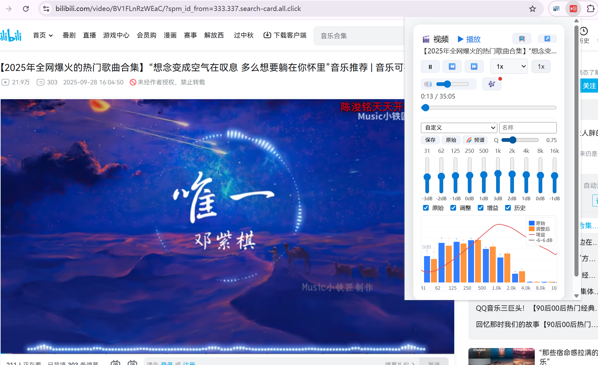

[English](README_en.md) | [中文](README.md)

# GMC-Enhance

统一控制 · 强大的快捷键 · 独立的标签页会话

Global Media Control (GMC)-Enhance 是一个 Chrome 扩展程序，它增强了 Chrome 内置的全局媒体控制功能。它提供了真正的**统一控制**，**全局快捷键**实现即时操作，以及**独立的标签页会话**，使每个标签页保持其播放、速度和效果状态而互不干扰。

> 版本更新记录：见 [RELEASE.md](RELEASE.md)

## 目录

1. [功能](#功能)
2. [用户指南](#用户指南)
   - [基本播放控制](#1-基本播放控制)
   - [音频效果控制](#2-音频效果控制)
   - [快捷键](#3-快捷键)
3. [安装方法](#安装方法)
4. [贡献](#贡献)
5. [许可证](#许可证)
6. [权限](#权限)

## 功能

GMC-Enhance 提供以下核心能力：

- **统一媒体控制**：一个工具栏入口控制所有标签页的音视频。
- **播放 & 进度控制**：播放 / 暂停 / 快退 / 快进（可配置步长）。
- **播放速度管理**：增减 / 重置 / 预设循环 + 图标倍速徽章（≠1x 显示）。
- **全局快捷键**：Seek、倍速、音量、静音、视频选择，支持自定义映射。
- **独立标签会话**：速度、音量、EQ 状态互不干扰。
- **音量与静音控制**：步进调节与快速静音。
- **均衡器 (EQ)**：10 段基础频段调节与预设。
- **浮动 HUD**：快捷键操作即时反馈，支持跨标签同步。

> 更完整的历史版本记录见 [RELEASE.md](RELEASE.md)。

## 用户指南

### 1. 基本播放控制

直接通过工具栏或键盘快捷键控制视频播放。支持的操作包括播放、暂停、快退/快进以及速度调整。

### 2. 音频效果控制

通过高级音频控制提升您的聆听体验。例如：

- 通过降低 1kHz–4kHz 频段的频率来减少人声音量。
- 通过增加低频段来增强低音。

这些调整对直播或音频不平衡的视频特别有用。

功能包括：
- 10 段均衡器：从 31Hz 到 16kHz 的频段调节。
- 预设管理：保存、加载和删除自定义均衡器预设。
- 实时频谱：显示当前音频的频谱图，帮助您可视化音频效果。

### 3. 快捷键

GMC-Enhance 支持以下键盘快捷键，用于快速、无干扰的媒体控制；在扩展选项页中可以为每个操作设置自定义组合键，并提供冲突检测与一键恢复默认。

| 操作                  | 快捷键              | 描述                                                                                                      |
|-----------------------|---------------------|-----------------------------------------------------------------------------------------------------------|
| 选择控制的视频        | `Alt + Shift + V`   | 选择要控制的视频。                                                                                       |
| 播放/暂停             | `Alt + Shift + K`   | 切换选定视频的播放/暂停状态。 如果您在有视频的页面上，默认情况下此快捷键控制该视频，除非您已使用 `Alt + Shift + V` 选择了其他视频。 |
| 快退                  | `Alt + Shift + J`   | 快退（默认：-15 秒）。 如果您在有视频的页面上，默认情况下此快捷键控制该视频，除非您已使用 `Alt + Shift + V` 选择了其他视频。      |
| 快进                  | `Alt + Shift + L`   | 快进（默认：+15 秒）。 如果您在有视频的页面上，默认情况下此快捷键控制该视频，除非您已使用 `Alt + Shift + V` 选择了其他视频。       |
| 加速播放              | `Alt + Shift + O`   | 增加播放速度（默认：+0.5x）。                                                                            |
| 减速播放              | `Alt + Shift + U`   | 减少播放速度（默认：-0.5x）。                                                                            |
| 重置速度              | `Alt + Shift + I`   | 将播放速度重置为正常（默认：1x）。                                                                        |
| 循环倍速              | `Alt + Shift + P`   | 在预设播放速度之间循环切换。                                                                             |
| 增加音量              | `Alt + Shift + >`   | 增加音量（默认：+10%）。                                                                                 |
| 减少音量              | `Alt + Shift + <`   | 减少音量（默认：-10%）。                                                                                 |
| 静音/取消静音         | `Alt + Shift + M`   | 切换静音/取消静音。                                                                                       |
| 视频截屏              | `Alt + Shift + S`   | 对当前选中视频截取一帧（优先原始分辨率，若受限则退回捕获可见区域）。                                               |

**提示**：通过将快捷键映射到键盘旋钮，您可以精确控制视频进度，这也是开发此扩展的灵感来源。通过“扩展管理 → GMC-Enhance → 选项”进入配置页，可捕获新的组合键或恢复默认映射。

### 4. 图标徽章与视觉提示

- 红色图标：当前页面 EQ 存在非零增益修改。
- 橘色徽章：当前标签页播放速度（隐藏于 1x）。
- 组合显示时：同时表明“已调 EQ 且处于非常规倍速”。

### 5. 常见问题简答

| 问题 | 解答 |
|------|------|
| 为什么有时 HUD 不实时更新？ | 当控制的媒体不在当前活动标签页时，后台轮询 200ms 同步；切回本页则由内容脚本帧驱动。 |
| 直播视频调节 Seek 没反应？ | 直播流被识别后 Seek 会降级为状态提示，不执行跳转。 |
| 速度徽章不显示？ | 仅当速率 ≠ 1x；恢复 1x 自动清除。 |
| 旧预设加载后少了 Q？ | 老预设未包含 Q，会使用当前全局 Q；重新保存即可写入。 |

## 安装方法

### 方式一：谷歌商店直接安装

- 打开 [Chrome 网上应用店 GMC-Enhance 页面](https://chromewebstore.google.com/detail/kibmlbbigjmpmfjpcjhlmimehchnamgi?utm_source=item-share-cb)。
- 点击“添加至 Chrome”按钮，按提示完成安装。

### 方式二：解压安装（适用于无法访问商店或本地调试）

1. 前往 [GitHub Release 页面](https://github.com/ZepengW/GMC-Enhance/releases) 下载最新的安装包（ZIP格式）。
2. 解压下载的 ZIP 文件到本地文件夹。
3. 打开 Chrome，进入 `chrome://extensions/` 页面。
4. 开启右上角“开发者模式”。
5. 点击“加载已解压的扩展程序”，选择刚才解压的文件夹。
6. 安装完成后即可使用 GMC-Enhance。

## 贡献

欢迎贡献！如果您想为 GMC-Enhance 做出贡献，请按照以下步骤操作：

1. Fork 此仓库。
2. 为您的功能或错误修复创建一个新分支。
3. 提交更改并提交拉取请求。

对于重大更改，请先打开一个 issue 讨论您想要更改的内容。

## 许可证

此项目根据 [GNU 通用公共许可证 v3.0](https://www.gnu.org/licenses/gpl-3.0.en.html) 许可。您可以根据 GPL-3.0 许可证的条款自由使用、修改和分发此软件，该许可证确保衍生作品保持开源。

## 权限

GMC-Enhance 请求其功能所需的最低权限：

- `activeTab`：在用户调用扩展 UI 时与当前标签页交互，并捕获可见标签页的屏幕截图。
- `tabs`：需要枚举标签页并向其发送消息以获取媒体信息/控制。
- `storage`：保存偏好设置，如快进/速度步长、均衡器预设、音量步长和快捷键映射。

## Star History

